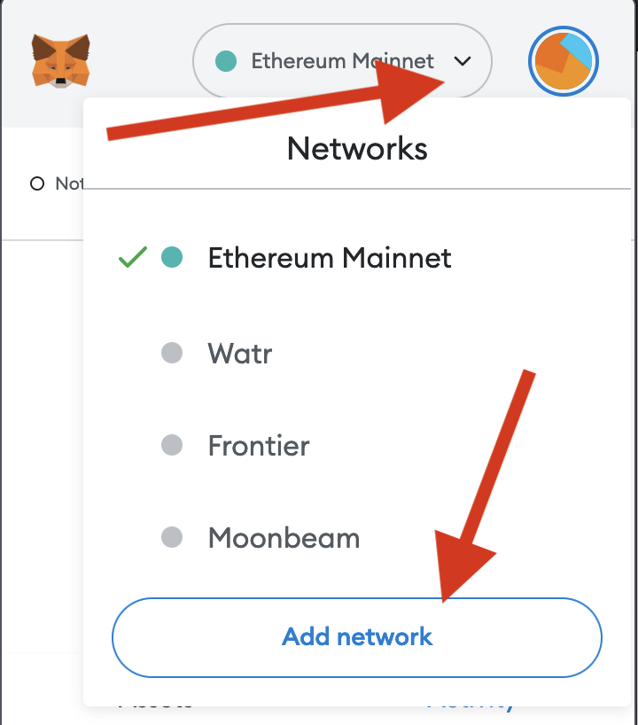
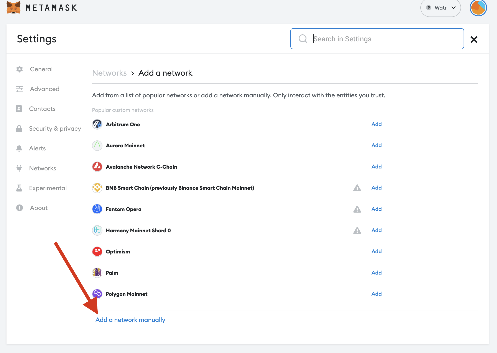
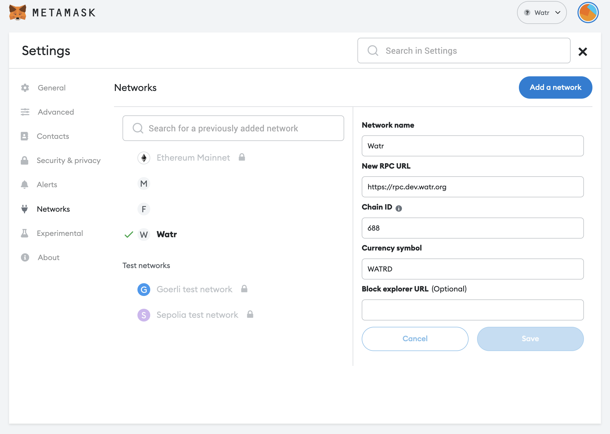

# Connect Metamask

1. Open Metamask extension
2. Select the network dropdown
3. Select `Add Network`
    
    
    
4. Select `Add a network manually`
    
    
    
5. Provide the following information:
    1. Network name: `Watr`
    2. New RPC URL:
        1. Devnet: `https://rpc.dev.watr.org`
        2. Mainnet: `https://rpc.watr.org`
        3. Local: `http://127.0.0.1:8833`, the RPC port can be modified in the Zombienet configs
    3. Chain ID: `688`
    4. Currency symbol:
        1. Devnet: `WATRD`
        2. Mainnet: `WATR`
    

