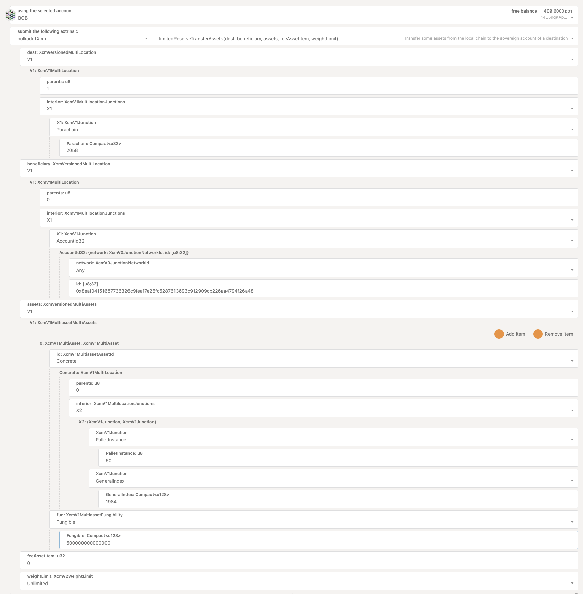
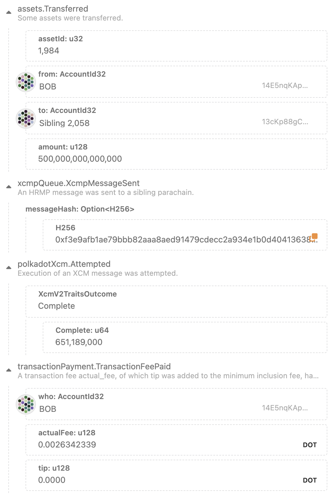
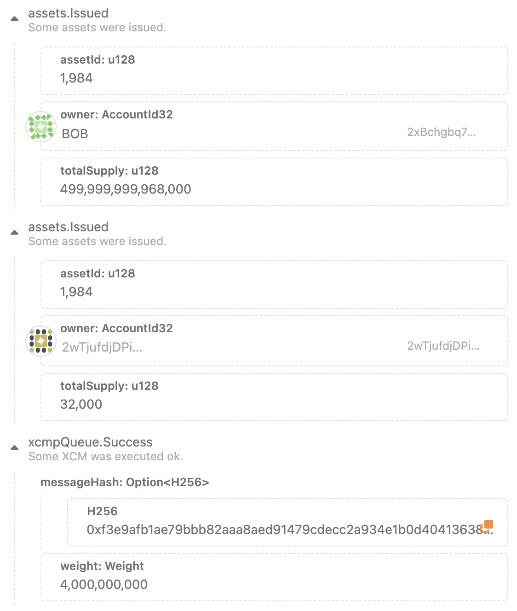
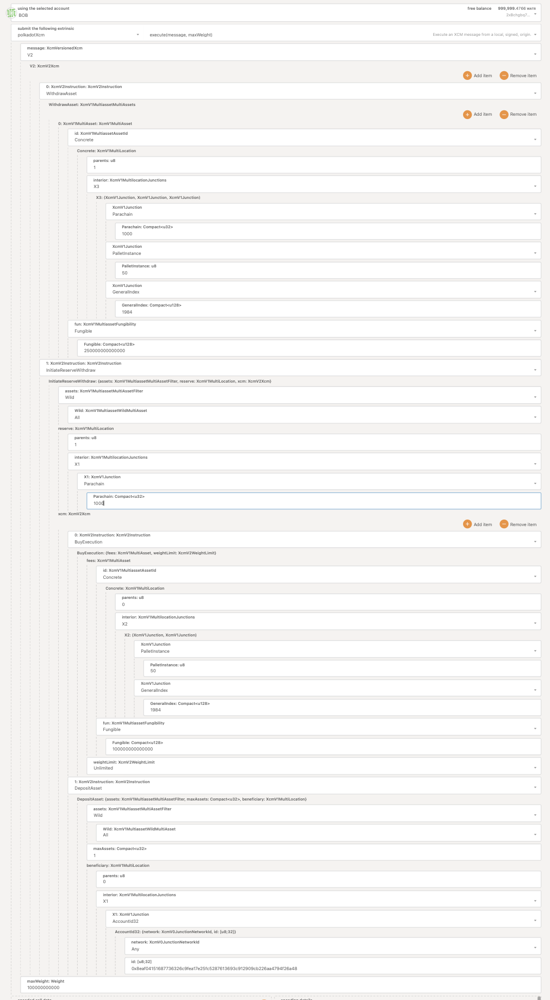
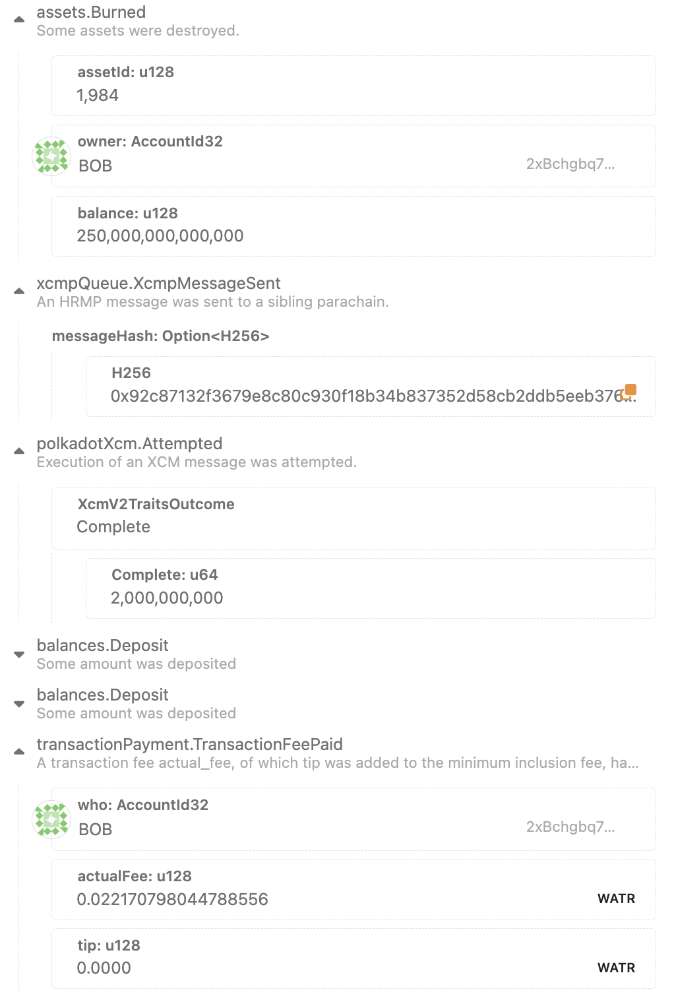
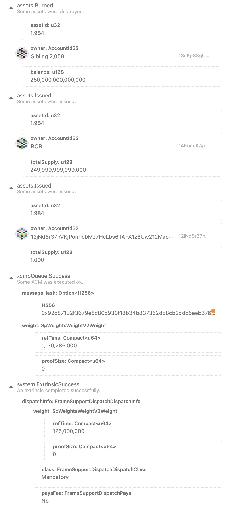

# Cross Chain Assets Transfer
*January 24th, 2023*

Right now there is only one available asset to send between Parachains: a derivative of `USDt` where Statemint acts as the reserve of the asset.

The derivate USDt asset in Watr:
	- `assetId = 1984`
	- `decimals = 6`
	- `minimumBalance = 10,000` (1 cent)

## How to
### Reserve Transfer USDt from Statemint to Watr
1. Get some USDt in an account you own in Statemint with some DOTs

2. Reseve Transfer USDt to Watr:

	Encoded Call example of Bob Statemint sending to Bob Watr
	```
	0x1f0801010100292001000101008eaf04151687736326c9fea17e25fc5287613693c912909cb226aa4794f26a480104000002043205011f000f00406352bfc6010000000000
	```
	

	Events
	- Statemint
		- USDt total amount is sent from Bob to the Watr Sovereign account
		- Bob pays some DOT fees
		

	- Watr
		- USDt derivatives are minted. Total USDt amount minus fees are Issued to Bob
		- USDt fees are sent to block author (collator)
		

### Send back USDt from Watr to Statemint
1. Initiate Reserve Withdraw

	Encoded Call example of Bob Watr sending back to Statemint half of the USDt he received
	```
	0x1f030208000400010300a10f043205011f000b00a031a95fe3100100010100a10f0813000002043205011f000b00407a10f35a000d010004000101008eaf04151687736326c9fea17e25fc5287613693c912909cb226aa4794f26a4800e8764817000000
	```
	

	Events
	- Watr
		- USDt derivatives amount to send is Burned from sender account
		- Bob pays some Watr fees
		

	- Statemint
		- USDt sent amount is Bruned from the Watr Sovereign account in Statemint
		- USDt sent amount minus fees are Issued to Bob Statemint
		- USDt fees are sent to block author (collator)
		

## Note
- Minimum amount that can be sent from Statemint to Watr in `32,000` (32 cents) which is the required USDt fee in Watr
	- If a lower amount is sent, the asset will be transfered to the Watr Sovereign account in Statemint but it will fail in Watr.
		- `xcmpQueue.Fail.TooExpensive` (not able to pay the fees)

- Similarly will happen when sending from Watr to Statmint. Minimum amount that can be sent (at the time of writting) is `1183` (1 milicent)
	- If a lower amount is sent, the asset will be burned from the Watr sender and from the Watr Sovereign account in Statemint, but it fail trying to deposit it in the beneficiary.
		- `xcmpQueue.Fail.TooExpensive` (not able to pay the fees)

- Minimum `maxWeight` to send from Watr to Statemint is `2,000,000,000` (we recommend just use `100,000,000,000`)
