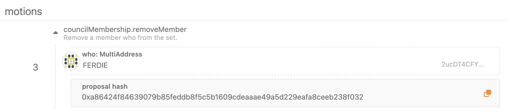

# Watr Governance Guide
*January 24th, 2023*

The initial governance is built using `pallet-collective`, `pallet-membership`, and a wrapper pallet `pallet-motion`.

## Overview
- pallet-collective
    - Allows a group of accounts to vote on a proposal / motion.
    - Accounts can be added and removed.
    - Can contain a prime-voter (set to `None` by default)
        - A prime-voter decides the default vote for abstentions
- pallet-membership
    - A pallet to more easily manage accounts in a collective (membership)
- pallet-motion
    - A collective is unable to dispatch Root origin calls
    - `pallet-motion` wraps proposals and provides Root origin
    - Three configurable origins
        - SimpleMajority (1/2 + 1)
        - SuperMajority (2/3)
        - Unanimous (1/1)
    - Three wrapper extrinsics
        - simple_majority
            - Dispatches call if and only if the number of votes are greater than the SimpleMajority
        - super_majority
            - Dispatches call if and only if the number of votes are greater than or equal to the SuperMajority
        - unanimous
            - Dispatches call if and only if all collective members have voted yes

## Usage
### Setup Council
1. Register Councillors
   1.  ***Note: local testnets are preconfigured with Alice, Bob, Charlie, and Dave***
    2. Navigate to the Council -> Motion page
       1. *Note: if there are no council members, Sudo must be used* 
       
        
        
    3. For adding a single member
        1. From the dropdown, select `councilMembership.addMember`, and provide the desired address
        2. Submit transaction
        
        
    4. For removing a single member
        1. From the dropdown, select `councilMembership.removeMember`, and provide the desired address
        2. Submit transaction
        
        
    5. It is possible to (re)set many members at once, using `councilMembership.resetMembers` 
            
    6. Verify new councillors
        1. Via the Governance → Council page
        2. Or, via the Chain State page
            
            
            
    7. Note: `pallet-collective` (`council`) provides a `setMembers` extrinsic. Do NOT use this.
        1. All councillors should be added through `councilMembership`.
        2. Any changes through `councilMembership` will sync, and overwrite, `council`
        3. Any changes through `council` does not sync with `councilMembership`

### Perform Runtime Upgrade via Council
1. Create motion
    1. Navigate to the Governance → Council page
    2. Select the `Motion` tab
    3. Click the `Propose motion` button
    4. Provide the desired voting `Threshold`
        1. A threshold of 1 is automatically executed after the motion is proposed.
    5. Extrinsics that do not require Sudo, or accept the council origin, can be inputted directly
        1. For example, the `treasury` accepts the council origin. I.e., it does not require Sudo.
    6. Otherwise, extrinsics must be wrapped using `motion.{simpleMajority, superMajority, unanimous}`
    7. This motion example will schedule a runtime upgrade
        1. Select `motion` and choose the desired majority required
            1. `simpleMajority` requires 1/2 + 1 of votes
            2. `superMajority` requires 2/3 of votes
            3. `unanimous` requires 1/1 of votes
        2. Note: specify the threshold at or above the required majority
            1. If the threshold is less than the required majority, then the council motion will execute, but the `motion` call will fail with a `BadOrigin`. This is because the `motion` will not execute unless the majority is met
        3. Within the `motion` extrinsic, select `scheduler.schedule`. 
           1. Supply the block number desired for the runtime upgrade. The block number should account for the 7 day voting period
           2. Enter 0 for priority
           3. Set the call. Select `parachainSystem.authorizeUpgrade` and provide the wasm runtime file. 
           4. Note: it is not strictly necessary to use the scheduler. It, however, is a recommended practice when performing runtime upgrades.
        4. Click `✅ Propose`
            
            
            
    8. Still on the Governance → Council → Motion page, view the new motion (refresh the page if you do not see it)
        1. At the end of the `voting end` period, the motion will either
            1. Not be executed due to a lack of Ayes
            2. Or be executed
                1. The motion can be executed (closed) early if the voting threshold is met
                    
                    
                    
    9. Vote on the motion using the `Vote` button
        1. A motion may also be voted on via Developer → Extrinsics → `council.vote`
    10. When the voting threshold is met, the `Vote` button will change to a `Close` button
        1. Any council member may close the motion
        2. Closing the motion will execute it
    11. Close the proposal (or wait until the end of the voting period)
    12. Assuming the chosen majority is met, the motion will be executed
    13. View the emitted events to ensure the motion passed. A `BadOrigin` error means either the motion was not wrapped with pallet-motion, or the threshold for the majority was not met        
        
        
    14. After the scheduler executes the `authorizeUpgrade`, `parachainSystem.enactAuthorizedUpgrade` must be called.
        1.  Any account may call this (it does not need to pass through council).
        2.  `Submit Unsigned` to avoid paying a large fee (100 Watr)
        
    15. The runtime upgrade will begin, and the following events emitted
        1.  `parachainSystem.UpgradeAuthorized` is emitted after the scheduled `authorizeUpgrade` has ran
        2.  `parachainSystem.ValidateFunctionStored` is emitted after `enactAuthorizedUpgrade` has ran
        3.  `parachainSystem.ValidateFunctionApplied` is emitted after the relay chain accepted the upgrade, and the upgrade is performed

