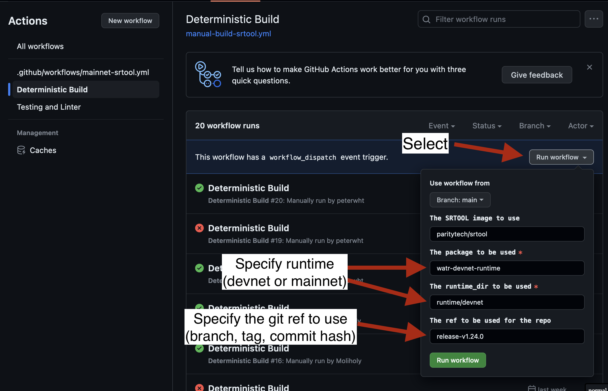
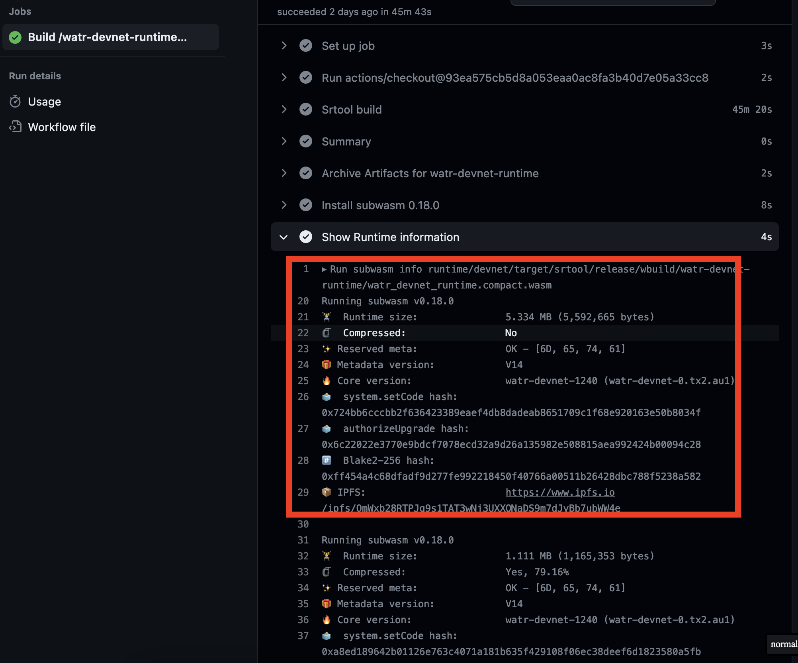

# Watr Release Guide

****************Summary****************

- Update versioning
- Create new branch with the format `release-vX.Y.Z`
- Build branch using srtool
- Save output of srtool
- Create new release in Github, supplying the output from srtool
- Test runtime upgrade locally
- Perform runtime upgrade on live-chain

1. **Update Versioning**
    1. Create temporary branch to create PR from
    2. Change version in the following locations
        1. `runtime/common/Cargo.toml`
        2. `runtime/devnet/Cargo.toml`
        3. `runtime/mainnet/Cargo.toml`
        4. `runtime/devnet/src/lib.rs`
            1. update `spec_version`
        5. `runtime/mainnet/src/lib.rs`
            1. update `spec_version`
        6. If the polkadot branch is changed, `node/Cargo.toml`
    3. Cargo.toml uses `X.Y.Z` while the `spec_version` field uses “XYYZ”. For example
        1. Cargo.toml: `1.1.1`
        2. spec_version: `1101`
    4. To update the `node/Cargo.toml` file (only if the polkadot branch has changed)
        1. If following (for example) `polkadot-v0.9.27`, then update the version to `0.9.270`
        2. For example, if updating to `polkadot-v0.9.33`, enter `0.9.330`
        3. Updates to the client requires a restart of collators
    5. Commit, and push changes
    6. Merge branch into main, assuming all checks passed
        1. It is good practice to run the following before merging
            1. `cargo fmt --all`
            2. `cargo clippy --all --features runtime-benchmarks`
            3. `cargo test`
            4. and parachains-integration-tests
2. **Create New Release Branch**
    1. Create new branch with name `release-vX.Y.Z`. For example,
        1. if the new version is `1.1.1`, then create branch `release-v1.1.1`
3. **************************Build Branch**************************
    1. Use the [Deterministic Build](https://github.com/Watr-Protocol/watr/actions/workflows/manual-build-srtool.yml) to build the release branch with srtool.

        1. After completion save the artifacts and copy the subwasm output 

            2. If the following error is outputted: `error: the lock file /build/Cargo.lock needs to be updated but --locked was passed to prevent this`, the solution is to rebuild the project (locally) and push the updated Cargo.lock   

    Subwasm output: 
5. ********************************************************Create New Release on Github********************************************************
    1. Navigate to the [release page](https://github.com/Watr-Protocol/watr/releases)
    2. Press “Draft a new release”
    3. Select the release branch in the “Target: release-vX.Y.Z” dropdown
    4. Create a new tag with the version (e.g. `v1.1.1`)
    5. Provide the release title
        1. If it is just devnet, explicitly add that to the name
        2. For example, “Watr Devnet v1.1.0”
    6. Provide release details, such as what has been added, and any breaking changes.
    7. If the client was changed (`node/`) make sure to include that
    8. Paste the srtool output
    9. Paste the subwasm output
    10. Include  the .wasm file as an asset
6. **Perform a Dry-Run Runtime Upgrade**
    1. Build the previous release branch
    2. Start the network with zombienet
    3. Perform the runtime upgrade (using the wasm generated from srtool)
    4. After the runtime upgrade completes, ensure everything performs as expected
        1. It is recommended to run the `parachains-integration-tests`
7. ******************************************************************Perform the Real Runtime Upgrade******************************************************************
    1. Perform the runtime upgrade (using the wasm generated from srtool) on the live network
        
